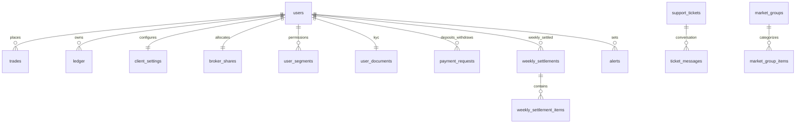

# 🗄️ MaintenX OS – Complete Database Schema & Data Dictionary
**Database Engine:** MySQL 8.4 RDS / MariaDB InnoDB  
**Character Set:** `utf8mb4` | **Collation:** `utf8mb4_general_ci`  
**Migration Engine:** [`sharemarket-aws-backend-master/src/config/migrate.js`](file:///d:/Trading%20Full%20Code/sharemarket-aws-backend-master/src/config/migrate.js)  
**Total Tables Documented:** 30 Production Tables  

---

## 1. Master Entity-Relationship Overview

---

## 2. Table-by-Table Data Dictionary

### 2.1 Table: `users`
Core identity table containing system credentials, roles, available balances, and credit limits.
| Column | Type | Nullable | Default | Key | Description |
| :--- | :--- | :---: | :---: | :---: | :--- |
| `id` | `INT` | ❌ No | `AUTO_INCREMENT` | **PK** | Unique User Identifier |
| `username` | `VARCHAR(100)` | ❌ No | — | **UK** | Unique login handle |
| `password` | `VARCHAR(255)` | ❌ No | — | — | Bcrypt hashed login password |
| `transaction_password` | `VARCHAR(255)` | ✅ Yes | `NULL` | — | 4-digit PIN for order & withdrawal authorization |
| `full_name` | `VARCHAR(255)` | ✅ Yes | `NULL` | — | Full legal name |
| `email` | `VARCHAR(255)` | ✅ Yes | `NULL` | — | Notification & statement email |
| `mobile` | `VARCHAR(20)` | ✅ Yes | `NULL` | — | Mobile contact number |
| `role` | `ENUM` | ❌ No | `'TRADER'` | **IDX**| `'SUPERADMIN'`, `'ADMIN'`, `'BROKER'`, `'TRADER'` |
| `status` | `ENUM` | ❌ No | `'Active'` | **IDX**| `'Active'`, `'Inactive'`, `'Suspended'` |
| `parent_id` | `INT` | ✅ Yes | `NULL` | **IDX**| Parent broker/admin `users.id` |
| `balance` | `DECIMAL(18,4)`| ❌ No | `0.0000` | — | Free trading capital available for margin |
| `credit_limit`| `DECIMAL(18,4)`| ❌ No | `0.0000` | — | Overdraft allowance granted by broker |
| `exposure_multiplier` | `INT` | ❌ No | `1` | — | Global account leverage multiplier |
| `city` | `VARCHAR(100)` | ✅ Yes | `NULL` | — | City location of branch/client |
| `is_demo` | `TINYINT(1)` | ❌ No | `0` | — | 1 = Virtual paper trader; 0 = Real ledger |
| `session_token`| `VARCHAR(500)`| ✅ Yes | `NULL` | — | Active JWT hash for single-device enforcement |
| `last_reset_at`| `DATETIME` | ✅ Yes | `NULL` | — | Timestamp of last weekly account reset |
| `created_at` | `TIMESTAMP` | ❌ No | `CURRENT_TIMESTAMP` | — | Record creation timestamp (IST) |
| `updated_at` | `TIMESTAMP` | ❌ No | `CURRENT_TIMESTAMP` | — | Auto-updated timestamp on modification |

---

### 2.2 Table: `client_settings`
Operational trading parameters, risk auto-liquidation thresholds, and feature flags per client.
| Column | Type | Nullable | Default | Key | Description |
| :--- | :--- | :---: | :---: | :---: | :--- |
| `user_id` | `INT` | ❌ No | — | **PK / FK** | References `users(id)` ON DELETE CASCADE |
| `allow_fresh_entry` | `TINYINT(1)` | ❌ No | `1` | — | 1 = Allowed to open new positions; 0 = Blocked |
| `allow_orders_between_hl` | `TINYINT(1)` | ❌ No | `1` | — | 1 = Restricts limit orders within day High/Low |
| `trade_equity_units` | `TINYINT(1)` | ❌ No | `0` | — | 1 = Equity trades in share units; 0 = Lot mode |
| `auto_close_at_m2m_pct`| `INT` | ❌ No | `90` | — | Margin utilization % triggering auto liquidation |
| `notify_at_m2m_pct` | `INT` | ❌ No | `70` | — | Margin threshold triggering warning alert |
| `min_time_to_book_profit` | `INT` | ❌ No | `120` | — | Minimum seconds to hold trade before profit exit |
| `scalping_sl_enabled` | `TINYINT(1)` | ❌ No | `0` | — | 1 = Enforces mandatory stop-loss on execution |
| `ban_all_segment_limit_order`| `TINYINT(1)` | ❌ No | `0` | — | 1 = Disallows placing limit orders across all segments |
| `broker_id` | `INT` | ✅ Yes | `NULL` | — | Associated parent broker identifier |
| `config_json` | `TEXT` | ✅ Yes | `NULL` | — | Extensible JSON settings override |

---

### 2.3 Table: `user_segments`
Market permissions, leverage, and brokerage rules defined for each market segment per client.
| Column | Type | Nullable | Default | Key | Description |
| :--- | :--- | :---: | :---: | :---: | :--- |
| `user_id` | `INT` | ❌ No | — | **PK / FK** | References `users(id)` ON DELETE CASCADE |
| `segment` | `VARCHAR(20)` | ❌ No | — | **PK** | `'MCX'`, `'EQUITY'`, `'OPTIONS'`, `'COMEX'`, `'FOREX'`, `'CRYPTO'` |
| `is_enabled` | `TINYINT(1)` | ❌ No | `0` | — | 1 = Enabled for active trading; 0 = Disabled |
| `brokerage_type` | `VARCHAR(30)` | ❌ No | `'PER_LOT'`| — | Calculation basis: `'PER_LOT'` or `'PER_CRORE'` |
| `brokerage_value`| `DECIMAL(18,4)`| ❌ No | `0.0000` | — | Numeric rate per lot or per crore turnover |
| `leverage` | `INT` | ❌ No | `1` | — | Segment-specific leverage factor |
| `max_lot_per_scrip` | `INT` | ❌ No | `10` | — | Maximum lots allowed in a single order |
| `margin_type` | `VARCHAR(30)` | ❌ No | `'PER_LOT'`| — | Margin requirement basis |
| `exposure_multiplier` | `INT` | ❌ No | `1` | — | Segment margin divisor (e.g. 500, 200) |
| `auto_square_off` | `TINYINT(1)` | ❌ No | `0` | — | 1 = Auto square off positions daily at cutoff |
| `square_off_time` | `VARCHAR(10)` | ✅ Yes | `NULL` | — | Daily liquidation time string (e.g. `'23:15'`) |

---

### 2.4 Table: `trades`
Core order book and live position ledger.
| Column | Type | Nullable | Default | Key | Description |
| :--- | :--- | :---: | :---: | :---: | :--- |
| `id` | `INT` | ❌ No | `AUTO_INCREMENT` | **PK** | Unique Trade Identifier |
| `user_id` | `INT` | ❌ No | — | **IDX** | References `users(id)` |
| `symbol` | `VARCHAR(50)` | ❌ No | — | **IDX** | Standardized ticker symbol (`GOLD`, `SILVER`) |
| `type` | `ENUM` | ❌ No | — | — | `'BUY'`, `'SELL'` |
| `order_type` | `ENUM` | ❌ No | `'MARKET'` | — | `'MARKET'`, `'LIMIT'`, `'STOP LOSS'` |
| `qty` | `INT` | ❌ No | — | — | Lot count (or shares in unit mode) |
| `entry_price` | `DECIMAL(18,4)`| ❌ No | — | — | Execution price at order entry |
| `exit_price` | `DECIMAL(18,4)`| ✅ Yes | `NULL` | — | Realized price upon trade liquidation |
| `stop_loss` | `DECIMAL(18,4)`| ✅ Yes | `NULL` | — | Trigger price for automatic loss protection |
| `target_price` | `DECIMAL(18,4)`| ✅ Yes | `NULL` | — | Trigger price for automatic profit taking |
| `status` | `ENUM` | ❌ No | `'OPEN'` | **IDX** | `'OPEN'`, `'CLOSED'`, `'HOLD'`, `'SETTLED'`, `'CANCELLED'`, `'DELETED'` |
| `is_pending` | `TINYINT(1)` | ❌ No | `0` | — | 1 = Unexecuted pending limit/SL order |
| `market_type` | `VARCHAR(50)` | ❌ No | `'MCX'` | — | Asset segment (`MCX`, `EQUITY`, `FOREX`, etc.) |
| `entry_time` | `TIMESTAMP` | ❌ No | `CURRENT_TIMESTAMP` | **IDX** | Order placement timestamp (IST) |
| `exit_time` | `TIMESTAMP` | ✅ Yes | `NULL` | — | Order close timestamp (IST) |
| `pnl` | `DECIMAL(18,4)`| ❌ No | `0.0000` | — | Realized net profit/loss on trade close |
| `brokerage` | `DECIMAL(18,4)`| ❌ No | `0.0000` | — | Commission debited on execution |
| `swap` | `DECIMAL(18,4)`| ❌ No | `0.0000` | — | Overnight financing charge debited |
| `margin_used` | `DECIMAL(18,4)`| ❌ No | `0.0000` | — | Locked collateral reserved for this position |
| `trade_ip` | `VARCHAR(45)` | ✅ Yes | `NULL` | — | IP address recorded at order entry |
| `close_ip` | `VARCHAR(45)` | ✅ Yes | `NULL` | — | IP address recorded at order close |
| `is_carried_forward`| `TINYINT(1)` | ❌ No | `0` | **IDX** | 1 = Position held across weekly settlement |
| `settlement_id` | `INT` | ✅ Yes | `NULL` | **IDX** | Linked `weekly_settlements.id` |
| `settlement_price` | `DECIMAL(18,4)`| ✅ Yes | `NULL` | — | Reference closing price at weekend settlement |

---

### 2.5 Table: `ledger`
Double-entry immutable financial ledger recording every balance modification.
| Column | Type | Nullable | Default | Key | Description |
| :--- | :--- | :---: | :---: | :---: | :--- |
| `id` | `INT` | ❌ No | `AUTO_INCREMENT` | **PK** | Unique Ledger Transaction ID |
| `user_id` | `INT` | ❌ No | — | **IDX** | References `users(id)` |
| `amount` | `DECIMAL(18,4)`| ❌ No | — | — | Mutation amount (+ credit, - debit) |
| `type` | `ENUM` | ❌ No | — | — | `'DEPOSIT'`, `'WITHDRAW'`, `'TRADE_PNL'`, `'BROKERAGE'`, `'SWAP'`, `'WEEKLY_SETTLEMENT'`, `'OPENING_BALANCE'` |
| `balance_before`| `DECIMAL(18,4)`| ✅ Yes | `NULL` | — | Running account balance prior to transaction |
| `balance_after` | `DECIMAL(18,4)`| ❌ No | — | — | Running account balance after transaction |
| `reference_id` | `VARCHAR(100)`| ✅ Yes | `NULL` | — | Linked trade ID, deposit ID, or UTR number |
| `reference_type`| `VARCHAR(50)` | ✅ Yes | `NULL` | — | Entity type linked (`TRADE`, `PAYMENT`, `SYSTEM`) |
| `remarks` | `TEXT` | ✅ Yes | `NULL` | — | Transaction description / admin notes |
| `created_at` | `TIMESTAMP` | ❌ No | `CURRENT_TIMESTAMP` | **IDX** | Transaction posting timestamp (IST) |

---

### 2.6 Table: `weekly_settlements` & `weekly_settlement_items`
Stores weekly account settlements executed every Sunday.

#### `weekly_settlements`
| Column | Type | Nullable | Default | Description |
| :--- | :--- | :---: | :---: | :--- |
| `id` | `INT` | ❌ No | `AUTO_INCREMENT (PK)` | Settlement report identifier |
| `user_id` | `INT` | ❌ No | — (FK) | References `users(id)` |
| `week_start_date`| `DATE` | ❌ No | — | Starting date of the settlement week |
| `week_end_date` | `DATE` | ❌ No | — | Ending cutoff date of the settlement week |
| `opening_balance`| `DECIMAL(18,4)`| ❌ No | `0.0000` | Cash balance at start of week |
| `realized_pnl` | `DECIMAL(18,4)`| ❌ No | `0.0000` | Net sum of realized PnL for closed trades |
| `unrealized_mtm_pnl`| `DECIMAL(18,4)`| ❌ No | `0.0000` | Floating M2M of open carried forward trades |
| `brokerage` | `DECIMAL(18,4)`| ❌ No | `0.0000` | Total brokerage debited during week |
| `closing_balance`| `DECIMAL(18,4)`| ❌ No | `0.0000` | Calculated balance carrying into next week |
| `carried_forward_trades_count`| `INT` | ❌ No | `0` | Number of open positions held over weekend |
| `settled_trades_count` | `INT` | ❌ No | `0` | Number of trades closed and settled |
| `settlement_status` | `ENUM` | ❌ No | `'COMPLETED'` | `'PENDING'`, `'COMPLETED'`, `'FAILED'` |

#### `weekly_settlement_items`
| Column | Type | Description |
| :--- | :--- | :--- |
| `id` | `INT (PK)` | Auto increment item row ID |
| `settlement_id` | `INT (FK)` | Linked `weekly_settlements.id` |
| `trade_id` | `INT (FK)` | Linked `trades.id` |
| `symbol` | `VARCHAR(50)` | Trading symbol settled |
| `settlement_price`| `DECIMAL(18,4)`| Price benchmark used for weekend settlement |
| `settled_pnl` | `DECIMAL(18,4)`| Profit or loss allocated to this trade leg |
| `is_carried_forward`| `TINYINT(1)`| 1 = Remains open; 0 = Fully closed |

---

### 2.7 Additional Production Supporting Tables

| Table Name | Primary Role | Key Columns |
| :--- | :--- | :--- |
| **`payment_requests`** | Client deposit / withdrawal requests | `user_id`, `amount`, `type`, `status`, `screenshot_url`, `bank_name`, `account_number`, `ifsc_code` |
| **`user_documents`** | Client KYC identity verification vault | `user_id`, `pan_number`, `pan_screenshot`, `aadhar_number`, `kyc_status`, `verified_at` |
| **`broker_shares`** | Broker revenue sharing & client limits | `user_id`, `share_pl_pct`, `share_brokerage_pct`, `trading_clients_limit`, `sub_brokers_limit` |
| **`banned_scrips`** | Globally blocked instruments | `symbol`, `created_by`, `created_at` |
| **`banned_limit_orders`**| Time-restricted limit order scrips | `scrip_id`, `start_time`, `end_time`, `created_by` |
| **`action_ledger`** | Administrative audit trail | `admin_id`, `action_type`, `target_table`, `description`, `timestamp` |
| **`expiry_rules`** | Expiry cutoffs & weekly settlement day | `user_id`, `auto_square_off`, `square_off_time`, `weekly_settlement_day`, `contract_mode` |
| **`market_groups`** | Watchlist groups (Nifty 50, MCX, Crypto)| `id`, `name`, `type`, `sort_order`, `is_active` |
| **`market_group_items`**| Symbols mapped to watchlist groups | `group_id`, `symbol`, `name`, `category`, `exchange`, `sort_order` |
| **`scrip_ticks_history`**| High-frequency tick database | `scrip_id`, `ltp`, `bid`, `ask`, `high`, `low`, `exchange_time`, `system_time` |
| **`alerts`** | Trader price alerts | `user_id`, `symbol`, `type ('above'/'below')`, `target_price`, `status` |
| **`voice_recordings`** | AI spoken command history & transcripts | `user_id`, `audio_filename`, `transcript`, `parsed_command`, `action_taken`, `status` |
| **`user_kite_sessions`**| Zerodha active token storage | `user_id`, `api_key`, `access_token`, `public_token`, `saved_at` |
| **`commodity_forex_crypto_lot_sizes`** | Commodity & FX multiplier overrides | `symbol`, `category`, `lot_size`, `usdinr_value`, `updated_at` |
