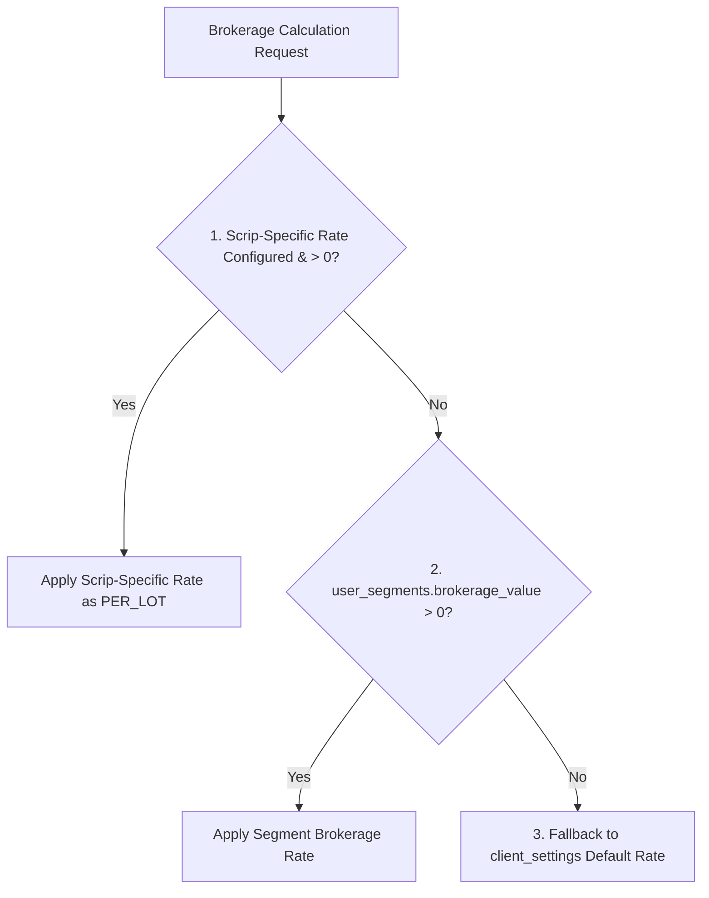

# 📊 Trading System – PnL, Margin & Brokerage Formula Specification

> **Official Testing & Implementation Reference Document**  
> *Strictly aligned with the system's calculation helpers in Backend (`sharemarket-aws-backend-master`) and Mobile/Webview (`TradeContext`).*

---

## 1. ⚡ Quick Formula Map

| Module | Core Mathematical Formula | Currency / Unit Basis |
| :--- | :--- | :--- |
| **Equity / NFO PnL** | **BUY:** $(Exit - Entry) \times TotalShares$<br>**SELL:** $(Entry - Exit) \times TotalShares$ | Native INR |
| **MCX Commodity PnL** | $(Exit - Entry) \times Lots \times LotSize$ | Native INR |
| **USD / International PnL** | $RawUSD\_PnL \times Selected\_USDINR\_Rate$ | USD $\rightarrow$ INR *(except direct INR pairs)* |
| **Per-Lot Brokerage** | $BaseLotsCount \times BrokerageRate$ | Rate per Lot / Unit |
| **Per-Crore Brokerage** | $\dfrac{(Entry + Exit) \times TotalQty \times FX\_Rate}{1,00,00,000} \times BrokerageRate$ | INR per ₹1 Crore Turnover |
| **Per-Lot Margin** | $LotCount \times MarginPerLot$ | Fixed INR per Lot |
| **Per-Turnover Margin** | $\dfrac{Price \times ActualQty \times FX\_Rate}{ExposureDivisor}$ | INR required margin |

---

## 2. 📈 PnL – Equity & NFO (Futures & Options)

### Formulas:
$$\text{BUY PnL} = (\text{Exit Price} - \text{Entry Price}) \times \text{Total Shares}$$
$$\text{SELL PnL} = (\text{Entry Price} - \text{Exit Price}) \times 
\text{Total Shares}$$

### Total Shares Priority Logic:
1. **Priority 1:** `actualQty` (if valid and $> 0$).
2. **Priority 2:** `qtyInput`:
   - If **Units Mode** $\rightarrow$ $\text{Total Shares} = qtyInput$
   - If **Lot Mode** $\rightarrow$ $\text{Total Shares} = qtyInput \times lotSize$
3. **Priority 3:** `qty` used directly as fallback.

> [!NOTE]
> This helper does **not** apply any USD/INR conversion. It evaluates pure price-difference $\times$ share quantity.

### Test Verification Cases:

| Test Case | Type | Entry | Exit | Qty | Lot Size | Mode | Formula Execution | Expected PnL |
| :--- | :---: | :---: | :---: | :---: | :---: | :---: | :--- | :---: |
| **BUY Profit** | BUY | 100 | 110 | 2 | 50 | Lot | $(110 - 100) \times (2 \times 50)$ | **+₹1,000** |
| **BUY Loss** | BUY | 110 | 100 | 2 | 50 | Lot | $(100 - 110) \times (2 \times 50)$ | **-₹1,000** |
| **SELL Profit** | SELL | 110 | 100 | 2 | 50 | Lot | $(110 - 100) \times (2 \times 50)$ | **+₹1,000** |
| **Units Mode BUY** | BUY | 100 | 110 | 25 | 50 | Units | $(110 - 100) \times 25$ | **+₹250** |
| **actualQty Override** | BUY | 100 | 110 | 2 | 50 | Lot | If `actualQty = 75`: $(110 - 100) \times 75$ | **+₹750** |

---

## 3. 🛢️ PnL – MCX (Commodities)

### Formulas:
$$\text{Total Units} = \text{Lots Count} \times \text{Lot Size}$$
$$\text{BUY PnL} = (\text{Exit Price} - \text{Entry Price}) \times \text{Total Units}$$
$$\text{SELL PnL} = (\text{Entry Price} - \text{Exit Price}) \times \text{Total Units}$$

> [!IMPORTANT]
> The MCX helper strictly computes $\text{Lots} \times \text{LotSize}$. It does not use equity unit mode and does not apply foreign exchange (USD/INR) conversion.

### Test Verification Cases:

| Commodity | Type | Entry | Exit | Lots | Lot Size | Total Units | Formula Execution | Expected PnL |
| :--- | :---: | :---: | :---: | :---: | :---: | :---: | :--- | :---: |
| **GOLD (Profit)** | BUY | 45,000 | 45,100 | 2 | 100 | 200 | $(45,100 - 45,000) \times 200$ | **+₹20,000** |
| **GOLD (Loss)** | BUY | 45,000 | 44,900 | 2 | 100 | 200 | $(44,900 - 45,000) \times 200$ | **-₹20,000** |
| **GOLD (Short Sell)**| SELL | 45,100 | 45,000 | 2 | 100 | 200 | $(45,100 - 45,000) \times 200$ | **+₹20,000** |
| **NATURALGAS** | BUY | 2.90 | 2.88 | 1 | 10,000 | 10,000 | $(2.88 - 2.90) \times 10,000$ | **-₹200** |

---

## 4. 🌐 PnL – Crypto / Forex / COMEX (International)

### Raw USD PnL:
$$\text{Raw PnL (USD)} = \text{Price Difference} \times \text{Lot Size} \times \text{Quantity}$$
- **BUY:** $\text{Price Difference} = \text{Exit Price} - \text{Entry Price}$
- **SELL:** $\text{Price Difference} = \text{Entry Price} - \text{Exit Price}$

### 4.1 Direct INR Pairs (e.g. `USDINR`)
- Detected when the normalized symbol equals `USDINR` or ends with `USDINR`.
$$\text{PnL (INR)} = \text{Raw PnL}$$
$$\text{PnL (USD)} = \dfrac{\text{PnL (INR)}}{\text{Current Ask (or fallback USD/INR)}}$$
*(Effective USD/INR rate is fixed at 1.0 for direct INR pairs).*

### 4.2 Foreign / USD-Priced Pairs (BTC, EURUSD, XAUUSD, etc.)
$$\text{PnL (USD)} = \text{Raw PnL}$$
$$\text{PnL (INR)} = \text{PnL (USD)} \times \text{Selected USD/INR Rate}$$

#### ⚠️ Dynamic Asymmetric FX Rate Selection Rule:
- **If PnL (USD) $\ge 0$ (Profit):**  
  Uses **`liveAsk`** rate.  
  *Fallback (if no live rate):* `fallbackUsdInr × 0.90` (e.g., $95.1 \times 0.90 = \mathbf{85.59}$).
- **If PnL (USD) $< 0$ (Loss):**  
  Uses **`liveBid`** rate.  
  *Fallback (if no live rate):* `fallbackUsdInr × 1.10` (e.g., $95.1 \times 1.10 = \mathbf{104.61}$).

### Test Verification Cases:

| Scenario / Asset | Raw USD PnL | Rate Selection Logic | Rate Applied | Expected PnL (INR) |
| :--- | :---: | :--- | :---: | :---: |
| **BTC BUY Loss**<br>Entry: 85578.03, Exit: 85557.95 | **-20.08 USD** | Negative PnL $\rightarrow$ `liveBid`<br>Fallback: $95.1 \times 1.10$ | 104.61 | $-20.08 \times 104.61 = \mathbf{-₹2,100.57}$ |
| **BTC BUY Profit**<br>Entry: 85557.95, Exit: 85577.95 | **+20.00 USD** | Positive PnL $\rightarrow$ `liveAsk`<br>Fallback: $95.1 \times 0.90$ | 85.59 | $+20.00 \times 85.59 = \mathbf{+₹1,711.80}$ |
| **USDINR Pair**<br>Move: +1.00, Lot: 1000, Qty: 1 | **+1000.00** | Direct INR Pair (no conversion) | 1.00 | **+₹1,000.00** |

---

## 5. 💼 Brokerage – Centralized Helper

### 5.1 Brokerage Hierarchy Priority



| Priority | Source | Behavior / Description |
| :---: | :--- | :--- |
| **1 (Highest)** | **Scrip-Specific Rate** | Used first whenever configured and $> 0$. Evaluated as `PER_LOT`. |
| **2** | **`user_segments.brokerage_value`** | Standard configured rate per client segment. |
| **3 (Lowest)** | **`client_settings` Fallback** | General system fallback if segment value is absent. |

---

### 5.2 Brokerage Calculation Modes

#### Mode A: `PER_LOT` / `PER_UNIT`
$$\text{Brokerage} = \text{Base Lots Count} \times \text{Brokerage Rate}$$
*(Note: In Unit Mode with `actualQty`, Base Lots Count may be a fractional lot: $\text{qty} \div \text{lotSize}$).*

#### Mode B: `PER_CRORE` (Turnover Basis)
$$\text{Turnover (INR)} = (\text{Entry Price} + \text{Exit Price}) \times \text{Total Shares} \times (\text{USD/INR if international})$$
$$\text{Brokerage} = \left(\dfrac{\text{Turnover (INR)}}{1,00,00,000}\right) \times \text{Brokerage Rate}$$

### Test Verification Cases:

| Asset & Trade | Entry | Exit | Qty / Lots | USD/INR | Rate Config | Step-by-Step Calculation | Brokerage |
| :--- | :---: | :---: | :---: | :---: | :---: | :--- | :---: |
| **BTC/USD** | 85,578.03 | 85,557.95 | 1 Lot (Qty=1) | 83.50 | ₹800 / Cr | Turnover: $(85578.03 + 85557.95) \times 1 \times 83.50 = ₹1,42,89,854.33$<br>Brokerage: $(14289854.33 \div 10^7) \times 800$ | **₹1,143.19** |
| **Equity (Small)** | 100 | 110 | 100 Shares | N/A | ₹800 / Cr | Turnover: $(100 + 110) \times 100 = ₹21,000$<br>Brokerage: $(21,000 \div 10^7) \times 800$ | **₹1.68** |
| **Equity (Large)** | 1,000 | 1,100 | 10,000 Shares| N/A | ₹800 / Cr | Turnover: $(1000 + 1100) \times 10,000 = ₹2,10,00,000$<br>Brokerage: $(2,10,00,000 \div 10^7) \times 800$ | **₹1,680.00** |
| **MCX Gold** | 45,000 | 45,100 | 2 Lots | N/A | ₹20 / Lot | Brokerage: $2 \times 20$ | **₹40.00** |

---

## 6. 🏛️ Brokerage – Segment-Specific Rules (`calculateTradeBrokerage`)

| Segment | Brokerage Source Key | Special Enforcement Rules |
| :--- | :--- | :--- |
| **MCX** | `mcxBrokerage` + `mcxBrokerageType` | Can be configured as `PER_CRORE` or `PER_LOT`. Scrip map overrides if present. |
| **Options** | `optionsIndex` / `optionsEquity` / `optionsMcx` | Brokerage rate and type configured separately for each options category. |
| **Equity / NSE / NFO** | `clientConfig.equityBrokerage` | **Forced to `PER_CRORE`** in the centralized calculation helper. |
| **COMEX** | `comexConfig` / `clientConfig` | Uses configured `brokerageType`; international turnover converted via USD/INR. |
| **FOREX** | `forexConfig` / `clientConfig` | Uses configured `brokerageType`; international turnover converted via USD/INR. |
| **CRYPTO** | `cryptoConfig` / `clientConfig` | Uses configured `brokerageType`; international turnover converted via USD/INR. |

---

## 7. 🛡️ Margin – Segment Margin Calculator

### 7.1 Market Type & Options Auto-Detection
- The helper auto-detects `marketType` from symbols (`MCX`, `FOREX`, `CRYPTO`, `COMEX`).
- Options contracts are identified by **`CE` / `PE`** suffixes or `marketType === 'OPTIONS'`.

### 7.2 Exposure Configuration Aliases

| Segment | Intraday Exposure Parameter | Holding Exposure Parameter | Exposure Type / Basis |
| :--- | :--- | :--- | :--- |
| **MCX (Futures)** | `mcxIntradayMargin` (aliases) | `mcxHoldingMargin` (aliases) | Configured `mcxExposureType` |
| **Options MCX** | `optionsMcxIntraday` | `optionsMcxHolding` | `optionsExposureType` |
| **Options Index** | `optionsIndexIntraday` | `optionsIndexHolding` | `optionsExposureType` |
| **Options Equity** | `optionsEquityIntraday` | `optionsEquityHolding` | `optionsExposureType` |
| **Equity / NSE / NFO** | `equityIntradayMargin` | `equityHoldingMargin` | Strictly `PER_TURNOVER_BASIS` |
| **COMEX / FOREX / CRYPTO**| Segment Intraday Aliases | Segment Holding Aliases | Segment `exposureType` |

> [!NOTE]
> System defaults if configuration is missing: **Intraday Exposure = 500**, **Holding Exposure = 100**.

---

### 7.3 Actual Quantity for Margin Evaluation
- **MCX:** $\text{Actual Qty} = \text{qty} \times \text{lotSize}$ *(unless Unit Mode is active)*.
- **Equity / NSE / NFO / Options:**  
  If not Unit Mode and $\text{qty} < \text{lotSize} \rightarrow \text{Actual Qty} = \text{qty} \times \text{lotSize}$;  
  otherwise $\text{Actual Qty} = \text{qty}$.
- **International (Forex / Crypto / Comex):** $\text{Actual Qty} = \text{qty} \times \text{Effective Lot Size}$.

### 7.4 International Fallback Lot Sizes

| Symbol Family | Fallback Lot Size |
| :--- | :---: |
| `EURUSD` / `GBPUSD` / `USDCHF` / `USDJPY` / `AUDCAD` | **100,000** |
| `USDINR` | **1,000** |
| `USOIL` / `UKOIL` | **1,000** |
| `NGAS` (Natural Gas International) | **10,000** |
| `XAUUSD` (Gold Spot) | **100** |
| `XAGUSD` (Silver Spot) | **5,000** |
| `COPPER` (International) | **2,500** |

---

### 7.5 Margin Calculation Formulas

#### Method 1: `PER_LOT_BASIS`
- **If Symbol-Specific Margin Exists:**
  $$\text{Margin} = \text{Lot Count} \times \text{Margin Per Lot}$$
  *(where $\text{Lot Count} = \text{qty} \div \text{lotSize}$ if qty is total units, else $\text{qty}$)*
- **If No Symbol-Specific Margin:**
  $$\text{Margin} = \dfrac{\text{Price} \times \text{Actual Qty}}{\text{Active Exposure}}$$

#### Method 2: `PER_TURNOVER_BASIS`
$$\text{Turnover} = \text{Price} \times \text{Actual Qty}$$
$$\text{Turnover (INR)} = \text{Turnover} \times \text{fallbackUsdInr} \quad \text{\small (for non-INR Forex/Crypto/Comex)}$$
$$\text{Margin} = \dfrac{\text{Turnover (INR)}}{\text{Active Exposure}}$$

### Test Verification Cases:

| Asset & Mode | Price | Qty | Lot Size | Exposure | Detailed Step Calculation | Required Margin |
| :--- | :---: | :---: | :---: | :---: | :--- | :---: |
| **MCX Gold (Intraday)** | 45,000 | 2 | 100 | 200 | $(45000 \times 200) \div 200$ | **₹45,000** |
| **MCX Gold (Holding)** | 45,000 | 2 | 100 | 800 | $(45000 \times 200) \div 800$ | **₹11,250** |
| **BTC/USD (Intraday)** | 85,000 | 1 | 1 | 500 | $(85000 \times 1 \times \text{USDINR}) \div 500$ | **Depends on FX** |
| **EURUSD (Intraday)** | 1.10 | 1 | 100,000 | 500 | $(1.10 \times 100000 \times \text{USDINR}) \div 500$ | **Depends on FX** |

---

## 8. ⚖️ Core Differences: Margin vs Brokerage vs PnL

| Attribute | PnL (Profit & Loss) | Margin (Collateral) | Brokerage (Per-Lot) | Brokerage (Per-Crore) |
| :--- | :--- | :--- | :--- | :--- |
| **Primary Purpose** | Trader's realized/unrealized gain | Locked collateral required to hold position | Fixed execution commission | Turnover-based exchange charge |
| **Formula Base** | Price difference $\times$ Qty | Total trade value $\div$ Exposure | Lots count $\times$ Rate | $(\text{Entry} + \text{Exit}) \times \text{Qty} \times \text{Rate}$ |
| **Uses Entry + Exit?**| ❌ No *(diff only)* | ❌ No *(entry price only)* | ❌ No | ✅ **Yes** *(both legs)* |
| **Uses Exposure Divisor?** | ❌ No | ✅ **Yes** *(e.g. 500, 200)* | ❌ No | ❌ No |
| **Affected by Live Bid/Ask?**| ✅ **Yes** *(asymmetric FX)* | ❌ No *(uses standard FX)* | ❌ No | ❌ No *(uses standard FX)* |

---

## 9. 🔍 Complete Benchmark Walkthrough: BTC/USD Trade

```
Trade Parameters:
• Instrument: BTC/USD
• Entry Price: 85,578.03 USD
• Exit Price:  85,557.95 USD
• Quantity:    1
• Lot Size:    1
```

### 1. PnL Calculation:
$$\text{Raw USD PnL} = 85,557.95 - 85,578.03 = \mathbf{-20.08\text{ USD}}$$
$$\text{Applicable FX Rate (Negative PnL Fallback)} = 95.1 \times 1.10 = \mathbf{104.61}$$
$$\text{Final PnL (INR)} = -20.08 \times 104.61 = \mathbf{-₹2,100.57}$$

### 2. Brokerage Calculation (@ ₹800 / Crore):
$$\text{Combined Turnover (USD)} = (85,578.03 + 85,557.95) \times 1 = \mathbf{171,135.98\text{ USD}}$$
$$\text{Turnover (INR) @ 83.50 FX Rate} = 171,135.98 \times 83.50 = \mathbf{₹1,42,89,854.33}$$
$$\text{Brokerage} = \left(\dfrac{1,42,89,854.33}{1,00,00,000}\right) \times 800 = \mathbf{₹1,143.19}$$

> [!CAUTION]
> Notice that the **PnL Helper** and the **Brokerage Helper** receive separate USD/INR rates in code. PnL uses dynamic Bid/Ask (or 95.1 fallback), whereas Brokerage uses 83.50. This is by design in the existing code.

---

## 10. ✅ Master QA Verification Checklist

```markdown
### PnL Checks
- [ ] Verify BUY profit and BUY loss calculation across all segments.
- [ ] Verify SELL profit and SELL loss calculation across all segments.
- [ ] Test Lot Mode vs Unit Mode calculations independently.
- [ ] Test `actualQty` override priority when present vs when absent.
- [ ] Test `qtyInput` fallback to raw `qty`.
- [ ] Test direct `USDINR` pair: verify no double USD → INR conversion is applied.
- [ ] Test International pairs (BTC, EURUSD, XAUUSD) with both Positive (+USD) and Negative (-USD) PnL.
- [ ] Test dynamic FX switching: Verify `liveAsk` on profit, `liveBid` on loss.
- [ ] Test fallback FX multiplier: $95.1 \times 0.90$ on profit, $95.1 \times 1.10$ on loss.

### Brokerage Checks
- [ ] Verify `PER_LOT` brokerage calculation ($Lots \times Rate$).
- [ ] Verify `PER_CRORE` brokerage calculation ($Turnover \div 10^7 \times Rate$).
- [ ] Verify Scrip-Specific brokerage rate completely overrides generic segment rate.
- [ ] Verify rate lookup priority: `Scrip Map` → `user_segments` → `client_settings`.
- [ ] Verify double-leg turnover: $(Entry + Exit) \times Qty$.

### Margin Checks
- [ ] Test MCX symbol-specific fixed lot margin vs turnover margin fallback.
- [ ] Test Intraday exposure vs Holding exposure separately.
- [ ] Verify auto-detection of Options contracts (`CE` / `PE`) and options exposure selection.
- [ ] Verify international fallback lot sizes (EURUSD: 100k, XAUUSD: 100, NGAS: 10k).

### Client Management & Duplication
- [ ] Verify that copying or duplicating a client preserves all brokerage and margin keys.
- [ ] Verify that brokerage recalculation job updates historical ledger accurately.
```

---

## 11. 📌 Critical Code-Level Observations for Developers & QA

1. **Double-Leg Turnover in `PER_CRORE` Brokerage:**  
   Brokerage under `PER_CRORE` sums $(\text{Entry} + \text{Exit})$, charging commission on both buy and sell legs simultaneously at trade close.
2. **Three Distinct Foreign Exchange (USD/INR) Rates:**
   - **Brokerage Default FX:** `83.50`
   - **PnL Default FX:** `95.10` (with $\pm 10\%$ bid/ask spread factor)
   - **Margin Default FX:** `86.68`
   *(Each calculation engine receives its own independent FX parameter).*
3. **Duplicate Client Configuration:**  
   When using the "Copy Client" or "Duplicate User" features in Admin, ensure that all fields (`mcxBrokerage`, `mcxBrokerageType`, `equityIntradayMargin`, `optionsExposureType`, etc.) are mapped completely to avoid resetting to system defaults.