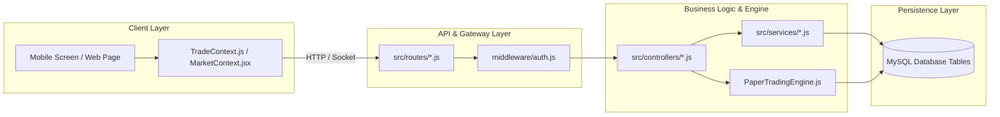

# 🗺️ MaintenX OS – Complete Implementation & Codebase Mapping
**Document Version:** 2.0 (Engineering Architecture Blueprint)  
**Purpose:** Precise Multi-Tier Traceability Matrix from UI Components to Database Storage  

---

## 1. Feature Traceability & Architectural Flow

---

## 2. Exhaustive Module-by-Module Codebase Map

### 2.1 User Authentication & Profile Security
| Architectural Layer | Specific File Path | Function / Component | Notes |
| :--- | :--- | :--- | :--- |
| **Mobile APK UI** | [`src/screens/auth/LoginScreen.js`](file:///d:/Trading%20Full%20Code/trading-updated-apk-main/src/screens/auth/) | `LoginScreen` component | Stores JWT in encrypted storage |
| **Web Admin UI** | [`src/pages/LoginPage.jsx`](file:///d:/Trading%20Full%20Code/Trading_Frontend-main/src/pages/LoginPage.jsx) | `LoginPage` component | Authenticates Superadmin, Admin, Broker |
| **Webview UI** | [`src/pages/AuthPages.jsx`](file:///d:/Trading%20Full%20Code/Trading_Webview-main/src/pages/AuthPages.jsx) | `Login` component | Client login inside embedded browser |
| **Client Context** | [`src/context/AuthContext.jsx`](file:///d:/Trading%20Full%20Code/Trading_Frontend-main/src/context/AuthContext.jsx) | `AuthProvider`, `useAuth` | Manages permissions & inactivity logout |
| **Backend Route** | [`src/routes/authRoutes.js`](file:///d:/Trading%20Full%20Code/sharemarket-aws-backend-master/src/routes/authRoutes.js) | `POST /login`, `POST /verify-otp` | Handles session creation |
| **Backend Controller** | [`src/controllers/authController.js`](file:///d:/Trading%20Full%20Code/sharemarket-aws-backend-master/src/controllers/authController.js) | `login()`, `getCurrentUser()` | Compares bcrypt passwords, issues JWT |
| **Database Tables** | MySQL Schema | `users`, `ip_logins`, `ip_logs` | Logs IP, device, and active session token |

---

### 2.2 Watchlist & Real-Time Market Streaming
| Architectural Layer | Specific File Path | Function / Component | Notes |
| :--- | :--- | :--- | :--- |
| **Mobile APK UI** | [`src/screens/tabs/DashboardScreen.js`](file:///d:/Trading%20Full%20Code/trading-updated-apk-main/src/screens/tabs/DashboardScreen.js) | `DashboardScreen` | Displays market groups & scrip cards |
| **Web Admin UI** | [`src/pages/market/MarketWatchPage.jsx`](file:///d:/Trading%20Full%20Code/Trading_Frontend-main/src/pages/market/MarketWatchPage.jsx) | `MarketWatchPage` | Comprehensive desktop market watch |
| **Webview UI** | [`src/pages/Dashboard.jsx`](file:///d:/Trading%20Full%20Code/Trading_Webview-main/src/pages/) | `Dashboard` | Mobile-first live quotes |
| **Mobile Context** | [`src/context/TradeContext.js`](file:///d:/Trading%20Full%20Code/trading-updated-apk-main/src/context/TradeContext.js) | `normalizeSymbol()`, socket listeners | Receives and normalizes live ticks |
| **Backend Engine** | [`src/websocket/SocketManager.js`](file:///d:/Trading%20Full%20Code/sharemarket-aws-backend-master/src/websocket/SocketManager.js) | `init()`, `price_update` broadcast | Throttles and streams quotes to clients |
| **Market Service** | [`src/services/MarketDataService.js`](file:///d:/Trading%20Full%20Code/sharemarket-aws-backend-master/src/services/MarketDataService.js) | `getCryptoPrices()`, `getForexPrices()`| In-memory real-time quote repository |
| **Upstream Stream** | [`src/utils/kiteService.js`](file:///d:/Trading%20Full%20Code/sharemarket-aws-backend-master/src/utils/kiteService.js) | `KiteTicker` WebSocket client | Subscribes to MCX, NSE, NFO binary feed |
| **Database Tables** | MySQL Schema | `market_groups`, `market_group_items` | Defines scrips shown on watchlists |

---

### 2.3 Order Management & Position Execution
| Architectural Layer | Specific File Path | Function / Component | Notes |
| :--- | :--- | :--- | :--- |
| **Mobile Order Modal**| [`src/components/OrderBottomSheet.js`](file:///d:/Trading%20Full%20Code/trading-updated-apk-main/src/components/) | `OrderBottomSheet` | Validates lots, displays margin required |
| **Web Admin Trades** | [`src/components/CreateTradeForm.jsx`](file:///d:/Trading%20Full%20Code/Trading_Frontend-main/src/components/CreateTradeForm.jsx) | `CreateTradeForm` | Admin placing trades for clients |
| **Order Placement API**| [`src/routes/tradeRoutes.js`](file:///d:/Trading%20Full%20Code/sharemarket-aws-backend-master/src/routes/tradeRoutes.js) | `POST /api/trades` | Order entry route |
| **Execution Controller**| [`src/controllers/tradeController.js`](file:///d:/Trading%20Full%20Code/sharemarket-aws-backend-master/src/controllers/tradeController.js)| `createTrade()`, `closeTrade()` | Pre-trade margin check, order persistence |
| **Matching Engine** | [`src/trading-engine/PaperTradingEngine.js`](file:///d:/Trading%20Full%20Code/sharemarket-aws-backend-master/src/trading-engine/PaperTradingEngine.js)| `processTick()`, `executeOrder()` | In-memory limit/stop order matching |
| **Database Tables** | MySQL Schema | `trades`, `users` (balance lock) | Records open/closed trades & margin locked |

---

### 2.4 Live M2M & Risk Management (RMS)
| Architectural Layer | Specific File Path | Function / Component | Notes |
| :--- | :--- | :--- | :--- |
| **Mobile Portfolio** | [`src/screens/tabs/PortfolioScreen.js`](file:///d:/Trading%20Full%20Code/trading-updated-apk-main/src/screens/tabs/PortfolioScreen.js) | `PortfolioScreen` | Live position PnL cards with flash alerts |
| **Web Admin M2M** | [`src/pages/dashboard/LiveM2MPage.jsx`](file:///d:/Trading%20Full%20Code/Trading_Frontend-main/src/pages/dashboard/LiveM2MPage.jsx) | `LiveM2MPage` | Real-time matrix across all traders |
| **Risk Daemon** | [`src/services/RMSService.js`](file:///d:/Trading%20Full%20Code/sharemarket-aws-backend-master/src/services/RMSService.js) | `evaluateAllTradersRisk()` | Continuous margin sentinel (10s loop) |
| **Target / SL Daemon**| [`src/services/targetSLService.js`](file:///d:/Trading%20Full%20Code/sharemarket-aws-backend-master/src/services/targetSLService.js) | `startTargetSLMonitoring()` | Sub-second SL / Target trigger watcher |
| **Pending Order Daemon**| [`src/services/PendingOrderService.js`](file:///d:/Trading%20Full%20Code/sharemarket-aws-backend-master/src/services/PendingOrderService.js)| `startPendingOrderMonitoring()` | Executes limit orders on tick match |
| **Database Tables** | MySQL Schema | `trades`, `client_settings`, `action_ledger`| Stores margin rules and auto-squareoff logs |

---

### 2.5 Financials, Deposits & Double-Entry Ledger
| Architectural Layer | Specific File Path | Function / Component | Notes |
| :--- | :--- | :--- | :--- |
| **Mobile Funds View** | [`src/screens/tabs/AccountScreen.js`](file:///d:/Trading%20Full%20Code/trading-updated-apk-main/src/screens/tabs/AccountScreen.js) | `AccountScreen` | Shows ledger history & bank details |
| **Admin Deposits** | [`src/pages/requests/DepositRequestsPage.jsx`](file:///d:/Trading%20Full%20Code/Trading_Frontend-main/src/pages/requests/DepositRequestsPage.jsx)| `DepositRequestsPage` | Approve/Reject client deposits |
| **Ledger Audit View** | [`src/pages/funds/TraderFundsPage.jsx`](file:///d:/Trading%20Full%20Code/Trading_Frontend-main/src/pages/funds/TraderFundsPage.jsx) | `TraderFundsPage` | Detailed double-entry statement review |
| **Ledger API Routes** | [`src/routes/fundRoutes.js`](file:///d:/Trading%20Full%20Code/sharemarket-aws-backend-master/src/routes/fundRoutes.js) | `GET /ledger/:userId`, `POST /entry` | Ledger endpoints |
| **Fund Controller** | [`src/controllers/fundController.js`](file:///d:/Trading%20Full%20Code/sharemarket-aws-backend-master/src/controllers/fundController.js)| `getLedger()`, `createFundEntry()` | Atomic balance mutations |
| **Database Tables** | MySQL Schema | `ledger`, `payment_requests`, `users` | Immutable audit rows and running balances |

---

### 2.6 Weekly Settlements & Expiry Liquidations
| Architectural Layer | Specific File Path | Function / Component | Notes |
| :--- | :--- | :--- | :--- |
| **Web Admin Settings**| [`src/pages/settings/GlobalSettingsPage.jsx`](file:///d:/Trading%20Full%20Code/Trading_Frontend-main/src/pages/settings/GlobalSettingsPage.jsx)| `GlobalSettingsPage` | Configure weekly settlement day/time |
| **Settlement Daemon** | [`src/services/WeeklySettlementService.js`](file:///d:/Trading%20Full%20Code/sharemarket-aws-backend-master/src/services/WeeklySettlementService.js)| `startWeeklySettlementJob()` | Auto-cron executing Sunday settlements |
| **Expiry Daemon** | [`src/services/expirySquareOffService.js`](file:///d:/Trading%20Full%20Code/sharemarket-aws-backend-master/src/services/expirySquareOffService.js)| `startExpirySquareOffJob()` | Daily contract liquidation daemon |
| **Reset ID Daemon** | [`src/services/ResetIDService.js`](file:///d:/Trading%20Full%20Code/sharemarket-aws-backend-master/src/services/ResetIDService.js) | `startResetIDScheduler()` | Weekly account refresher daemon |
| **Database Tables** | MySQL Schema | `weekly_settlements`, `weekly_balances` | Archives weekly performance and invoices |
