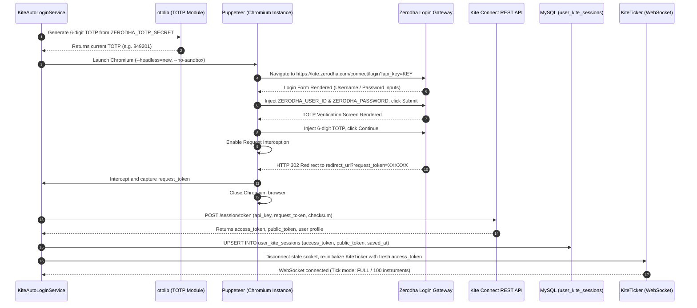
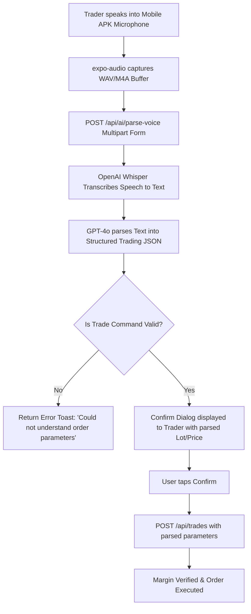

# 🌐 MaintenX OS – External Integration Architecture Manual
**Document Version:** 2.0 (Enterprise Comprehensive)  
**Classification:** Core System Architecture & Integration Blueprint  
**Target Environments:** AWS Cloud / On-Premise Enterprise Linux / Windows Server  
**Primary Engine:** `sharemarket-aws-backend-master`  

---

## 1. High-Level Architectural Topology

MaintenX OS connects distributed client interfaces (Mobile App, Web Admin, Mobile Webview) with external financial exchange feeds, cloud storage layers, artificial intelligence services, and automated banking webhooks.

```mermaid
graph TB
    subgraph "External Providers & Upstream Feeds"
        KITE_WSS["Zerodha Kite Ticker WSS<br/>(wss://ws.kite.trade)"]
        KITE_REST["Zerodha Kite REST API v3<br/>(https://api.kite.trade)"]
        OPENAI_API["OpenAI API v1<br/>(Audio Whisper + GPT-4o)"]
        AWS_S3["AWS S3 Bucket<br/>(ap-southeast-2 Document Vault)"]
        IMAGEKIT_CDN["ImageKit Global CDN<br/>(https://ik.imagekit.io)"]
        SMTP_SERVER["SMTP Mail Server<br/>(Port 587 TLS)"]
    end

    subgraph "MaintenX Node.js Server Cluster (Port 5000)"
        SERVER_CORE["Express 5.2.1 Core HTTP Server"]
        SOCKET_HUB["SocketManager.js<br/>Socket.io v4.8 Engine"]
        MARKET_CACHE["MarketDataService.js<br/>In-Memory Quote State"]
        KITE_DAEMON["KiteAutoLoginService.js<br/>Puppeteer Headless Auth"]
        OMS_ENGINE["PaperTradingEngine.js<br/>Order Execution & Matching"]
        RMS_ENGINE["RMSService.js<br/>Risk & Margin Sentinel"]
        REDIS_CACHE[("Redis 5.11 Cache<br/>Active Tokens & Session Cache")]
        MYSQL_DB[("MySQL 8.4 RDS Database<br/>Connection Pool (Max: 50)")]
    end

    subgraph "Client Applications"
        MOBILE_APK["Mobile Trader App<br/>(React Native 0.86 / Expo 57)"]
        WEB_ADMIN["Web Admin & Broker Portal<br/>(React 19 / Tailwind v4)"]
        WEBVIEW_CLIENT["Responsive Mobile Webview<br/>(React 19 / Vite 8)"]
    end

    KITE_WSS -->|Binary Ticks WSS| MARKET_CACHE
    KITE_REST -->|Instrument Dump CSV/JSON| MARKET_CACHE
    KITE_DAEMON -->|Automated Request Token| KITE_REST
    MARKET_CACHE -->|Throttled JSON Broadcast (50ms)| SOCKET_HUB
    SOCKET_HUB -->|Room: user:id & role:role| MOBILE_APK
    SOCKET_HUB -->|Room: user:id & role:role| WEB_ADMIN
    SOCKET_HUB -->|Room: user:id & role:role| WEBVIEW_CLIENT
    MOBILE_APK -->|REST & Audio Buffers| SERVER_CORE
    WEB_ADMIN -->|REST Management APIs| SERVER_CORE
    SERVER_CORE -->|Whisper STT & GPT-4o| OPENAI_API
    SERVER_CORE -->|Presigned Uploads| AWS_S3
    SERVER_CORE -->|Image CDN Links| IMAGEKIT_CDN
    SERVER_CORE -->|Alerts & Statements| SMTP_SERVER
    SERVER_CORE <-->|Read / Write State| MYSQL_DB
    SERVER_CORE <-->|Fast Cache & Locks| REDIS_CACHE
```

---

## 2. Zerodha Kite Connect Integration Specification

### 2.1 Component Mapping & Files
- **Official SDK:** `kiteconnect@^5.1.0`
- **Controller:** [`src/controllers/kiteController.js`](file:///d:/Trading%20Full%20Code/sharemarket-aws-backend-master/src/controllers/kiteController.js)
- **Routes:** [`src/routes/kiteRoutes.js`](file:///d:/Trading%20Full%20Code/sharemarket-aws-backend-master/src/routes/kiteRoutes.js)
- **Low-Level Service Wrapper:** [`src/utils/kiteService.js`](file:///d:/Trading%20Full%20Code/sharemarket-aws-backend-master/src/utils/kiteService.js)
- **Instrument Synchronizer:** [`src/services/InstrumentSyncService.js`](file:///d:/Trading%20Full%20Code/sharemarket-aws-backend-master/src/services/InstrumentSyncService.js)

### 2.2 Headless Automated Login Engine (`KiteAutoLoginService.js`)
Zerodha invalidates access tokens daily between 00:00 and 06:00 IST. To ensure automated continuity for morning trading (09:00 IST for Equity/NSE, 09:15 for MCX), [`KiteAutoLoginService.js`](file:///d:/Trading%20Full%20Code/sharemarket-aws-backend-master/src/services/KiteAutoLoginService.js) executes an automated login cycle:

#### Execution Triggers:
1. **Cron Job:** `30 8 * * 1-5` (Runs Monday through Friday at exactly 8:30 AM IST).
2. **Native Timer Backup:** High-precision interval checking `Intl.DateTimeFormat` for `Asia/Kolkata` time every 10 seconds.
3. **Cold Boot Trigger:** Server startup check in `server.js` verifies if an active session exists for today; if not, triggers login immediately.

#### Step-by-Step Headless Authentication Sequence:


#### Headless Launch Configuration:
```javascript
const browser = await puppeteer.launch({
    headless: 'new',
    executablePath: process.env.PUPPETEER_EXECUTABLE_PATH || undefined,
    args: [
        '--no-sandbox',
        '--disable-setuid-sandbox',
        '--disable-dev-shm-usage',
        '--disable-accelerated-2d-canvas',
        '--no-first-run',
        '--no-zygote',
        '--disable-gpu',
        '--single-process',
        '--ignore-certificate-errors'
    ]
});
```

### 2.3 Instrument Master Synchronization
- Executes daily on server startup via `InstrumentSyncService.sync()`.
- Fetches the active instruments CSV from `https://api.kite.trade/instruments`.
- Maps instrument tokens to exchange trading symbols (`tradingsymbol`, `name`, `lot_size`, `instrument_type`, `segment`).
- Persists master records into MySQL table `script_testing` and loads MCX lot sizes into in-memory cache `CommodityLotService`.

---

## 3. Real-Time WebSocket Streaming Engine

### 3.1 Socket Cluster Architecture (`SocketManager.js`)
- **Library:** `socket.io@4.8.3`
- **Transport Modes:** `['websocket', 'polling']`
- **Connection Keep-Alive:** Ping interval: `25,000 ms`, Ping timeout: `60,000 ms`.
- **CORS Governance:** Whitelist matching `ALLOWED_ORIGINS` (Admin web, Trader webview, Expo local dev, and production domains).

### 3.2 Authentication & Room Separation
Every connecting socket handshake is authenticated via JWT:
```javascript
this.io.use((socket, next) => {
    const token = socket.handshake.auth?.token || socket.handshake.query?.token;
    if (!token) {
        socket.user = null;
        return next();
    }
    try {
        const decoded = jwt.verify(token, process.env.JWT_SECRET);
        socket.user = decoded;
        next();
    } catch (e) {
        socket.user = null;
        next();
    }
});
```
On `connection`, sockets emit `join`:
- **User Private Room:** `user:<userId>` (Receives trade fills, margin alerts, square-off notices).
- **Role Broadcast Room:** `role:<role>` (Superadmin alerts, maintenance broadcasts).

### 3.3 Wire Payload Format: `price_update`
Live market quotes are emitted at throttled intervals (maximum 20 updates/second per scrip) in a strictly standardized JSON schema:
```json
{
  "GOLD": {
    "ltp": 72540.00,
    "bid": 72538.00,
    "ask": 72542.00,
    "high": 72800.00,
    "low": 72100.00,
    "close": 72450.00,
    "open": 72200.00,
    "volume": 14250,
    "change": 90.00,
    "change_pct": 0.12
  },
  "SILVER": {
    "ltp": 89450.00,
    "bid": 89445.00,
    "ask": 89455.00,
    "high": 89900.00,
    "low": 88700.00,
    "close": 89100.00,
    "open": 88900.00,
    "volume": 38100,
    "change": 350.00,
    "change_pct": 0.39
  }
}
```

---

## 4. Artificial Intelligence & Voice Order Processing

### 4.1 Integration Specs
- **Provider:** OpenAI API (`openai@^6.32.0`)
- **Speech-to-Text Model:** `whisper-1`
- **Intent Parsing Model:** `gpt-4o`
- **Controller:** [`src/controllers/aiController.js`](file:///d:/Trading%20Full%20Code/sharemarket-aws-backend-master/src/controllers/aiController.js)

### 4.2 Spoken Command Execution Workflow


#### GPT-4o Intent Extraction Prompt Template:
```
You are an expert trading assistant for the MaintenX OS platform.
Extract trading actions from this transcript: "{transcript}".
Supported instruments: GOLD, SILVER, CRUDEOIL, COPPER, NATURALGAS, NIFTY, BANKNIFTY, BTC/USD, EUR/USD.
Return strictly valid JSON:
{
  "action": "BUY" | "SELL" | "CLOSE" | "STATUS",
  "symbol": string,
  "qty": number (lots),
  "order_type": "MARKET" | "LIMIT",
  "limit_price": number | null,
  "stop_loss": number | null,
  "target": number | null
}
```

---

## 5. Cloud Storage & Document Delivery (AWS S3 & ImageKit)

### 5.1 Dual-Storage Strategy
KYC documents (PAN, Aadhaar) and financial deposit payment receipts require high security at rest with rapid delivery to the Admin review portal:

| Capability | AWS S3 Implementation | ImageKit CDN Implementation |
| :--- | :--- | :--- |
| **SDK** | `@aws-sdk/client-s3@^3.1126.0` | `imagekit@^6.0.0` |
| **Region** | `ap-southeast-2` (Sydney / Asia-Pacific) | Global Edge CDN Nodes |
| **Privacy** | Private bucket; access via presigned URLs only | Signed transformation endpoints |
| **Use Case** | Archival of legal identity proofs & tax receipts | Fast image rendering in Web Admin review grid |
| **Local Fallback** | Stored locally in `uploads/` if cloud keys missing | Directly served via Express `/uploads` route |

---

## 6. Email Delivery & Notifications (Nodemailer)

### 6.1 Transactional Scenarios
- **Mailer File:** [`src/utils/mailer.js`](file:///d:/Trading%20Full%20Code/sharemarket-aws-backend-master/src/utils/mailer.js)
- **Library:** `nodemailer@^9.0.5`
- **Email Triggers:**
  1. **New User Provisioning:** Welcome email with username and temporary password.
  2. **Margin Call Warning:** Dispatched when trader account hits $70\%$ margin utilization.
  3. **Auto Square-Off Notice:** Real-time email confirming liquidation price and realized loss.
  4. **Weekly Settlement Invoices:** Automatic PDF statement generated via `pdfkit` attached every Sunday.

---

## 7. External Dependency Fail-Safe Matrix

| Service | Failure Mode | Detection Mechanism | Automated Recovery / Fallback Action |
| :--- | :--- | :--- | :--- |
| **Zerodha Kite Ticker** | Internet cut / Exchange socket drop | `ticker.on('disconnect')` event | Switches seamlessly to in-memory `mockEngine.js` tick simulation; retries connection every 5s. |
| **Kite Auto-Login** | Zerodha UI layout change / Captcha | Puppeteer catch block | Alerts SuperAdmin via SMS/Email; opens manual session input modal in Admin dashboard. |
| **AWS S3 Bucket** | S3 API rate limit / Invalid IAM keys | AWS SDK catch block | Automatically writes uploaded file to local disk (`uploads/`) and updates database path. |
| **OpenAI API** | API outage / Rate limit (HTTP 429) | Axios HTTP error handler | Falls back to deterministic regex parser for standard commands ("buy 1 lot gold"). |
| **MySQL Database** | Connection timeout / Process restart | Pool connection error event | Pool handles automatic reconnections with exponential backoff. |
