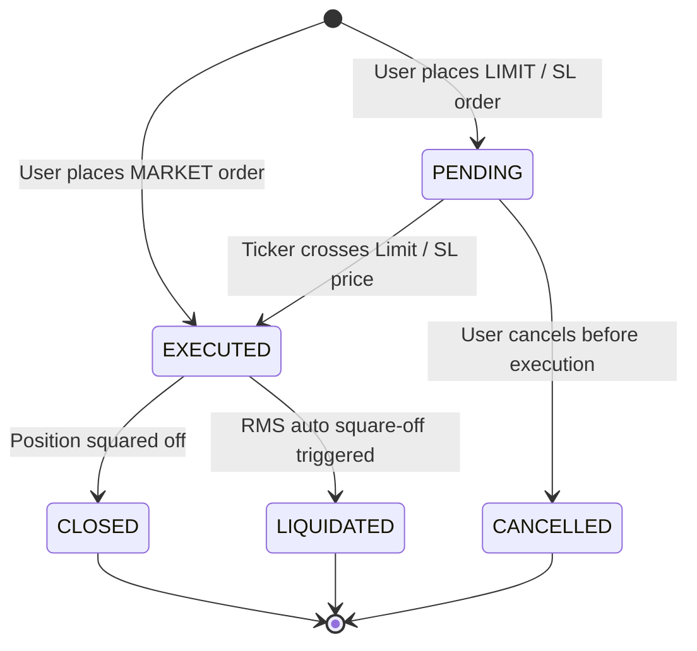

# 🛠️ MaintenX OS – Master Admin Backend Implementation Blueprint
**Document Version:** 2.0 (Engineering Architecture)  
**System Module:** Central Trading & Broking Backend  
**Directory Root:** `sharemarket-aws-backend-master`  

---

## 1. Complete Server Lifecycle Execution Pipeline

The server initialization in [`src/server.js`](file:///d:/Trading%20Full%20Code/sharemarket-aws-backend-master/src/server.js) follows an asynchronous multi-stage bootstrap pattern designed to prevent downtime and memory leaks on restarts:

```mermaid
flowchart TD
    A[Start Process: node src/server.js] --> B[1. Load .env Configuration]
    B --> C[2. Register Process Handlers: uncaughtException & unhandledRejection]
    C --> D[3. Register Graceful Shutdown Handlers: SIGINT / SIGTERM]
    D --> E[4. Initialize Express App, CORS Whitelist & Compression Middleware]
    E --> F[5. Create HTTP Server & Initialize Socket.io on Port 5000]
    F --> G[6. Bind Routes: 26 Route Modules & Root Endpoints]
    G --> H[7. HTTP server.listen on 0.0.0.0:5000 - IMMEDIATE PORT BIND]
    H --> I[8. Asynchronous runMigrations() Execution]
    I --> J[9. Background Daemons Startup: Cache, Kite Sync, Lot Sizes]
    J --> K[10. Start Schedulers: RMS, Target/SL, Pending Orders, Weekly Settlement]
```

### 1.1 Graceful Shutdown Implementation (`server.js`)
Prevents orphaned processes holding open ports or MySQL connections on Windows or Linux nodemon restarts:
```javascript
const gracefulShutdown = async (signal) => {
    console.log(`🔌 [Global] Received ${signal}. Shutting down gracefully...`);
    try {
        const db = require('./config/db');
        if (db && typeof db.end === 'function') {
            await db.end();
            console.log('✅ Database pool closed.');
        }
    } catch (err) {
        console.error('⚠️ Error closing DB pool during shutdown:', err.message);
    }
    process.exit(0);
};

process.on('SIGINT', () => gracefulShutdown('SIGINT'));
process.on('SIGTERM', () => gracefulShutdown('SIGTERM'));
```

---

## 2. Simulated Order Management System (`PaperTradingEngine.js`)

The engine provides realistic simulated matching for retail orders without routing to live broker exchange endpoints.

### Core Order Lifecycle:


### In-Memory State & Order Matching Algorithm:
```javascript
class PaperTradingEngine {
    constructor() {
        this.activeOrders = new Map();     // orderId -> orderObject
        this.openPositions = new Map();    // userId:symbol -> positionObject
    }

    processTick(symbol, tick) {
        // Evaluate all pending limit/stop orders for this symbol
        for (const [orderId, order] of this.activeOrders.entries()) {
            if (order.symbol !== symbol) continue;

            let isTriggered = false;
            if (order.type === 'BUY' && order.orderType === 'LIMIT' && tick.ask <= order.price) {
                isTriggered = true;
            } else if (order.type === 'SELL' && order.orderType === 'LIMIT' && tick.bid >= order.price) {
                isTriggered = true;
            } else if (order.orderType === 'STOP LOSS') {
                if (order.type === 'BUY' && tick.ask >= order.triggerPrice) isTriggered = true;
                if (order.type === 'SELL' && tick.bid <= order.triggerPrice) isTriggered = true;
            }

            if (isTriggered) {
                this.executeOrder(order, tick);
            }
        }
    }
}
```

---

## 3. Real-Time Risk Management System (`RMSService.js`)

The Risk Management System guarantees that traders cannot incur negative debt beyond their deposited collateral.

### Execution Routine:
```javascript
class RMSService {
    start(intervalMs = 10000) {
        setInterval(async () => {
            await this.evaluateAllTradersRisk();
        }, intervalMs);
    }

    async evaluateAllTradersRisk() {
        const [traders] = await db.execute(`
            SELECT u.id, u.username, u.balance, u.credit_limit, cs.auto_close_at_m2m_pct
            FROM users u
            JOIN client_settings cs ON u.id = cs.user_id
            WHERE u.role = 'TRADER' AND u.status = 'Active'
        `);

        for (const trader of traders) {
            const [openTrades] = await db.execute(
                `SELECT * FROM trades WHERE user_id = ? AND status = 'OPEN'`,
                [trader.id]
            );
            if (openTrades.length === 0) continue;

            let totalMarginUsed = 0;
            let totalUnrealizedLoss = 0;

            for (const trade of openTrades) {
                totalMarginUsed += parseFloat(trade.margin_used);
                const currentLtp = marketDataService.getLtp(trade.symbol);
                const m2m = this.calculateM2M(trade, currentLtp);
                if (m2m < 0) totalUnrealizedLoss += Math.abs(m2m);
            }

            const totalAvailableCapital = parseFloat(trader.balance) + parseFloat(trader.credit_limit);
            if (totalAvailableCapital <= 0) {
                await this.triggerEmergencySquareOff(trader, openTrades, 'Capital Exhausted');
                continue;
            }

            const utilizationPct = ((totalMarginUsed + totalUnrealizedLoss) / totalAvailableCapital) * 100;

            if (utilizationPct >= trader.auto_close_at_m2m_pct) {
                await this.triggerEmergencySquareOff(trader, openTrades, `Margin Utilization Breached: ${utilizationPct.toFixed(1)}%`);
            }
        }
    }
}
```

---

## 4. Native IST Scheduler Architecture

Standard `node-cron` libraries frequently experience timezone drift or miss triggers when servers reboot near midnight. MaintenX OS implements a **Dual-Redundant Scheduler Pattern**:
1. Primary: `node-cron` with `{ timezone: 'Asia/Kolkata' }`.
2. Secondary Backup: Continuous `setInterval(10000)` inspecting Indian Standard Time:

```javascript
const parts = new Intl.DateTimeFormat('en-US', {
    timeZone: 'Asia/Kolkata',
    weekday: 'short',
    year: 'numeric',
    month: '2-digit',
    day: '2-digit',
    hour: 'numeric',
    minute: 'numeric',
    hour12: false
}).formatToParts(new Date());

// Accurately extracts weekday (Mon-Fri) and triggers 8:30 AM Zerodha login
```

---

## 5. Security & Authentication Middleware (`auth.js`)

Every protected API route passes through `authenticateToken`:
```javascript
const jwt = require('jsonwebtoken');

function authenticateToken(req, res, next) {
    const authHeader = req.headers['authorization'];
    const token = authHeader && authHeader.split(' ')[1];

    if (!token) {
        return res.status(401).json({ success: false, message: 'Access denied. No token provided.' });
    }

    jwt.verify(token, process.env.JWT_SECRET, (err, user) => {
        if (err) {
            return res.status(403).json({ success: false, message: 'Invalid or expired token.' });
        }
        req.user = user;
        next();
    });
}
```

### Role-Based Access Control (RBAC):
```javascript
function authorizeRoles(...allowedRoles) {
    return (req, res, next) => {
        if (!req.user || !allowedRoles.includes(req.user.role)) {
            return res.status(403).json({ success: false, message: 'Forbidden: Insufficient privileges.' });
        }
        next();
    };
}
```
*(Usage: `router.post('/square-off-all', authenticateToken, authorizeRoles('SUPERADMIN'), controller.squareOffAll)`).*
