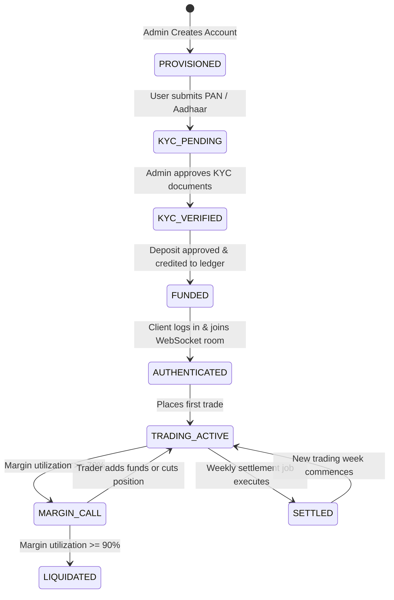
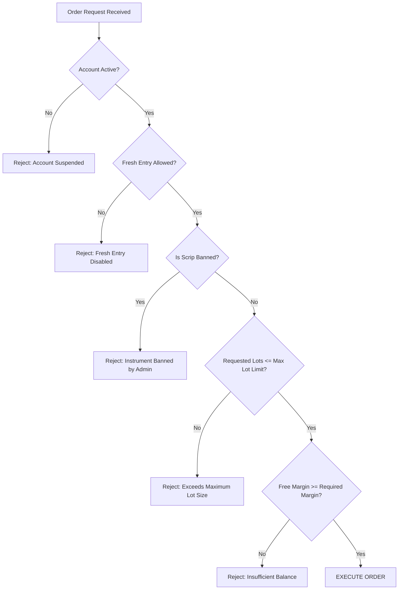

# 📖 MaintenX OS – A to Z Complete Client Data Flow Manual
**Document Version:** 2.0 (Exhaustive Operational Manual)  
**Scope:** Complete Lifecycle of a Client Account & Financial Transactions  
**Intended Readers:** Senior Developers, System Architects, QA Engineers, Support Leads  

---

## 1. Master Lifecycle State Machine



---

## 2. Phase-by-Phase Technical Walkthrough

### Phase 1: Client Onboarding & Hierarchy Association
1. **Initiation:** SuperAdmin or Master Broker opens `CreateClientPage.jsx`.
2. **Parameters Supplied:**
   - Personal: `username`, `password`, `full_name`, `mobile`, `email`, `city`.
   - Financial: `balance` (opening deposit), `credit_limit` (credit line), `exposure_multiplier` (leverage).
   - Relationship: `parentId` (links client to their parent Broker/Master).
3. **Database Transactions:**
   - Inserts record into `users` (`role = 'TRADER'`, `status = 'Active'`).
   - Inserts row into `client_settings`:
     - `allow_fresh_entry = 1`
     - `trade_equity_units = 0` (Lot Mode default)
     - `auto_close_at_m2m_pct = 90`
     - `notify_at_m2m_pct = 70`
     - `min_time_to_book_profit = 120` (2-minute scalping lock)
   - Inserts 6 distinct segment rows into `user_segments`:
     - `MCX`: `brokerage_type = 'PER_LOT'`, `brokerage_value = 20`, `max_lot_per_scrip = 10`
     - `EQUITY`: `brokerage_type = 'PER_CRORE'`, `brokerage_value = 800`, `max_lot_per_scrip = 500`
     - `OPTIONS`: `brokerage_type = 'PER_LOT'`, `brokerage_value = 50`, `max_lot_per_scrip = 20`
     - `COMEX`: `brokerage_type = 'PER_CRORE'`, `brokerage_value = 800`, `max_lot_per_scrip = 5`
     - `FOREX`: `brokerage_type = 'PER_CRORE'`, `brokerage_value = 800`, `max_lot_per_scrip = 5`
     - `CRYPTO`: `brokerage_type = 'PER_CRORE'`, `brokerage_value = 800`, `max_lot_per_scrip = 2`

---

### Phase 2: KYC Submission & Administrative Approval
1. Client uploads document scans via Mobile App `KycUploadPage.jsx`:
   - PAN card number & photo
   - Aadhaar card number & front/back photos
   - Bank passbook / cancelled cheque photo
2. Server stores images in AWS S3 / ImageKit and registers record in `user_documents` with `kyc_status = 'PENDING'`.
3. Admin reviews scans in Web Admin `TradingClientsPage.jsx` and approves:
   ```sql
   UPDATE user_documents SET kyc_status = 'VERIFIED', verified_at = CURRENT_TIMESTAMP WHERE user_id = ?;
   ```

---

### Phase 3: Fund Deposit & Double-Entry Ledger Posting
1. Client makes bank transfer (IMPS/NEFT/UPI) to broker bank account (listed in `new_client_bank`).
2. Client submits deposit request (`payment_requests`) with amount, UTR number, and screenshot.
3. Admin verifies bank statement and clicks **Approve** in `DepositRequestsPage.jsx`.
4. **Atomic Transaction Executes:**
   ```sql
   START TRANSACTION;
   -- 1. Update user balance
   UPDATE users SET balance = balance + 50000.00 WHERE id = 16;
   -- 2. Update request status
   UPDATE payment_requests SET status = 'APPROVED' WHERE id = 102;
   -- 3. Insert immutable ledger entry
   INSERT INTO ledger (user_id, amount, type, balance_before, balance_after, reference_id, remarks)
   VALUES (16, 50000.00, 'DEPOSIT', 0.00, 50000.00, 'DEP_102', 'Initial Capital Deposit Approved');
   COMMIT;
   ```

---

### Phase 4: Client Login & Real-Time Socket Binding
1. Trader logs in from Mobile App.
2. Server issues signed JWT token and records device footprint in `ip_logins`:
   - `ip_address`, `device_model`, `os`, `location`, `risk_score`.
3. Client opens WebSocket connection to `SocketManager.js`:
   - Emits `join` event: `{ userId: 16, role: 'TRADER' }`.
   - Socket server adds connection to private room `user:16`.
4. Client requests initial quotes via `request_market_snapshot`:
   - Server filters watchlist against `user_segments.is_enabled` and `banned_scrips`.
   - Server returns current quotes for Gold, Silver, Crude Oil, etc.

---

### Phase 5: Pre-Trade Validation Engine
When the trader taps **BUY** on `GOLD 26MAY`:


#### Exact Margin Formula Applied (MCX Gold Example):
- Price: ₹72,540.00
- Quantity: 1 Lot (100 Units)
- Exposure Multiplier: 500 (Configured in `user_segments`)
$$\text{Required Margin} = \dfrac{\text{Price} \times (\text{Lots} \times \text{Lot Size})}{\text{Exposure}} = \dfrac{72540 \times 100}{500} = \mathbf{₹14,508.00}$$
Server asserts: $\text{Available Free Balance} \ge ₹14,508.00$.

---

### Phase 6: Order Execution & Live Position Creation
Upon validation pass:
1. Trade row inserted into `trades`:
   ```sql
   INSERT INTO trades (user_id, symbol, type, order_type, qty, entry_price, margin_used, status, trade_ip)
   VALUES (16, 'GOLD', 'BUY', 'MARKET', 1, 72540.00, 14508.00, 'OPEN', '203.0.113.1');
   ```
2. Free balance is reduced by locked margin: $\text{Free Margin} = \text{Balance} - \text{Margin Used}$.
3. Socket event `trade_update` emitted to room `user:16`, rendering the position in Mobile `PortfolioScreen.js` immediately.

---

### Phase 7: Real-Time Tick Processing & M2M Updates
As new ticks arrive from Zerodha KiteTicker:
1. `SocketManager.js` broadcasts tick: `GOLD` LTP = `72,590.00`.
2. Mobile App `TradeContext.js` receives tick:
   $$\text{Real-Time M2M} = (\text{LTP} - \text{Entry Price}) \times \text{Lots} \times \text{Lot Size}$$
   $$\text{Real-Time M2M} = (72590 - 72540) \times 1 \times 100 = \mathbf{+₹5,000.00 \text{ (Profit)}}$$
3. Net M2M and total account equity update on the screen in **sub-100ms** without database queries.

---

### Phase 8: Position Square-Off & Realized Settlement
When the trader taps **Square Off**:
1. Exit price fetched from current live bid/ask: `Exit Price = 72,610.00`.
2. Realized PnL computed:
   $$\text{Realized PnL} = (72610 - 72540) \times 100 = \mathbf{+₹7,000.00}$$
3. Brokerage computed (Per-Lot @ ₹20/lot): $\text{Brokerage} = \mathbf{₹20.00}$.
4. **Atomic Liquidation Transaction:**
   ```sql
   START TRANSACTION;
   -- 1. Mark trade CLOSED
   UPDATE trades SET status = 'CLOSED', exit_price = 72610.00, exit_time = CURRENT_TIMESTAMP, pnl = 7000.00, brokerage = 20.00 WHERE id = 142;
   -- 2. Credit profit and refund margin to user balance
   UPDATE users SET balance = balance + 7000.00 - 20.00 WHERE id = 16;
   -- 3. Post Profit to Ledger
   INSERT INTO ledger (user_id, amount, type, balance_after, reference_id, remarks)
   VALUES (16, 7000.00, 'TRADE_PNL', 57000.00, 'TRADE_142', 'Profit on GOLD BUY');
   -- 4. Post Brokerage to Ledger
   INSERT INTO ledger (user_id, amount, type, balance_after, reference_id, remarks)
   VALUES (16, -20.00, 'BROKERAGE', 56980.00, 'TRADE_142', 'Brokerage for GOLD BUY');
   COMMIT;
   ```
5. Position moves to `ClosedTradesPage.jsx` in Admin and `TradesScreen.js` (Closed Tab) in Mobile APK.

---

### Phase 9: Weekly Settlement Cycle (Sunday 12:00 PM)
1. `WeeklySettlementService.js` executes auto-cron.
2. Identifies all traders with closed and open trades during the current week.
3. For open trades held across the weekend:
   - Sets `is_carried_forward = 1`.
   - Records current market price as `last_settlement_price`.
4. Generates weekly record in `weekly_settlements` and individual trade line items in `weekly_settlement_items`.
5. Net week result added to `weekly_balances`, creating the new week's opening balance.
