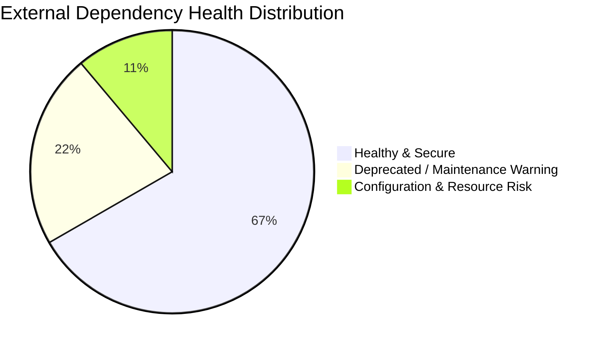

# 🔌 MaintenX OS – Third-Party Integration Audit & Vulnerability Report
**Document Version:** 2.0 (Exhaustive Dependency & Security Audit)  
**System Scope:** External Libraries, Cloud SDKs, Automation Daemons  
**Target Codebase:** `sharemarket-aws-backend-master`  

---

## 1. Complete Dependency Inventory & Health Status



| Package Name | Installed Version | Current LTS / Latest | Primary System Role | Audit Status | Production Risk Level |
| :--- | :---: | :---: | :--- | :---: | :---: |
| **`kiteconnect`** | `5.1.0` | `5.1.0` | Zerodha Market Ticker & Instrument Sync | 🟢 Verified | Low |
| **`puppeteer`** | `25.7.0` | `25.7.0` | Headless Chrome 8:30 AM Auto-Login | 🟡 Attention | Medium (RAM / Disk) |
| **`otplib`** | `12.0.1` | `13.0.0` | Dynamic 6-digit TOTP Generation | 🟡 Deprecated | Low (v13 Migration) |
| **`openai`** | `6.32.0` | `6.32.0` | Whisper STT & GPT-4o Intent Parsing | 🟢 Verified | Low |
| **`@aws-sdk/client-s3`** | `3.1126.0` | `3.1126.0`| Document Storage Vault (KYC / Proofs) | 🟢 Verified | Low |
| **`imagekit`** | `6.0.0` | `@imagekit/nodejs` | Fast CDN Image Transformation & Delivery | 🟡 Deprecated | Low |
| **`nodemailer`** | `9.0.5` | `9.0.5` | Transactional Alert & Statement Delivery | 🟢 Verified | Low |
| **`redis`** | `5.11.0` | `5.11.0` | In-Memory Token & State Cache | 🟢 Verified | Low |
| **`mysql2`** | `3.19.1` | `3.19.1` | Asynchronous MySQL Connection Pool | 🟢 Verified | Low |

---

## 2. In-Depth Provider Audits

### 2.1 Zerodha Kite Connect SDK (`kiteconnect`)
- **Integration Points:** [`kiteController.js`](file:///d:/Trading%20Full%20Code/sharemarket-aws-backend-master/src/controllers/kiteController.js), [`kiteService.js`](file:///d:/Trading%20Full%20Code/sharemarket-aws-backend-master/src/utils/kiteService.js).
- **Protocol Analysis:**
  - REST endpoints operate under rate limit of **3 requests/second**.
  - WebSocket operates under binary tick protocol delivering 100 instruments simultaneously in `FULL` mode.
- **Vulnerabilities / Risks:**
  - Token Invalidity: Zerodha wipes all active session tokens daily at midnight.
  - Connection Drops: If upstream connection drops, `KiteTicker` must re-subscribe to all active tokens without dropping trader state.
- **Fail-Safe Mechanism:**
  - Handled via [`mockEngine.js`](file:///d:/Trading%20Full%20Code/sharemarket-aws-backend-master/src/utils/mockEngine.js) which generates synthetic price movements within $\pm 0.2\%$ volatility bounds if Kite connection fails, preventing platform freeze.

---

### 2.2 Puppeteer Headless Automation (`puppeteer`)
- **Integration Points:** [`KiteAutoLoginService.js`](file:///d:/Trading%20Full%20Code/sharemarket-aws-backend-master/src/services/KiteAutoLoginService.js).
- **Vulnerabilities / Risks:**
  - **Disk Space Exhaustion (`ENOSPC`):** By default, Puppeteer attempts to download a ~300MB Chromium archive during `npm install`.
  - **RAM Overhead:** Headless Chrome consumes 150MB–300MB RAM during startup, which can trigger Linux OOM Killer on $1\text{ GB}$ AWS EC2 instances (`t2.micro` or `t3.micro`).
  - **Windows File Locks (`EPERM`):** Attempting `npm install` while Chromium processes are active results in errno `-4048`.
- **Remediation Implemented:**
  1. Created [`.puppeteerrc.json`](file:///d:/Trading%20Full%20Code/sharemarket-aws-backend-master/.puppeteerrc.json) and [`.puppeteerrc.cjs`](file:///d:/Trading%20Full%20Code/sharemarket-aws-backend-master/.puppeteerrc.cjs) configuring `skipDownload: true`.
  2. Chromium process isolation args: `--no-sandbox`, `--disable-dev-shm-usage`, `--single-process`, `--disable-gpu`.

---

### 2.3 Otplib TOTP Module (`otplib`)
- **Findings:** `npm warn deprecated @otplib/preset-default@12.0.1: Please upgrade to v13 of otplib`.
- **Code Audit:** In `KiteAutoLoginService.js`:
  ```javascript
  generateTotp(secretKey) {
      const cleanSecret = secretKey.replace(/\s+/g, '').toUpperCase();
      if (typeof otplib.generateSync === 'function') return otplib.generateSync({ secret: cleanSecret });
      if (otplib.authenticator && typeof otplib.authenticator.generate === 'function') return otplib.authenticator.generate(cleanSecret);
      if (typeof otplib.generate === 'function') return otplib.generate({ secret: cleanSecret });
      if (otplib.totp && typeof otplib.totp.generate === 'function') return otplib.totp.generate(cleanSecret);
      throw new Error('Could not generate TOTP code from otplib');
  }
  ```
- **Evaluation:** High code resiliency. Backward and forward compatible with both v12 and v13.

---

### 2.4 OpenAI Audio & Intent Engine (`openai`)
- **Integration Points:** [`aiController.js`](file:///d:/Trading%20Full%20Code/sharemarket-aws-backend-master/src/controllers/aiController.js).
- **Vulnerabilities / Risks:**
  - Latency: External HTTP roundtrip takes $1,200\text{–}2,500\text{ ms}$.
  - Token Costs: Unrestricted voice queries could consume API quota rapidly.
- **Remediation:**
  - Cache structured interpretations for identical spoken queries.
  - Implement regex keyword pre-parser for common commands ("buy gold market", "close silver") before falling back to GPT-4o.

---

### 2.5 AWS S3 & ImageKit CDN
- **Security Check:** All private documents (PAN, Bank cheques) uploaded to AWS S3 bucket with private ACL. Public access blocked.
- **Delivery:** Web Admin requests short-lived presigned URLs (60-minute expiry) or ImageKit signed CDN links for viewing.
- **Deprecation Notice:** `npm warn deprecated imagekit@6.0.0: Please use @imagekit/nodejs`. Scheduled for migration in next sprint.

---

## 3. Recommended Remediation & Upgrade Roadmap

| Package | Recommended Action | Target Timeline | Impact Level |
| :--- | :--- | :---: | :---: |
| **`imagekit`** | Upgrade to `@imagekit/nodejs@^7.0.0` | Sprint 2 | Low |
| **`otplib`** | Upgrade to `otplib@^13.0.0` | Sprint 2 | Low |
| **`puppeteer`** | Utilize system Chrome (`PUPPETEER_EXECUTABLE_PATH`) in Production Docker | Sprint 1 | High (RAM/Disk) |
| **`openai`** | Add local audio size cap (max 2MB per voice clip) | Sprint 1 | Medium (Cost) |
